<div align="center">

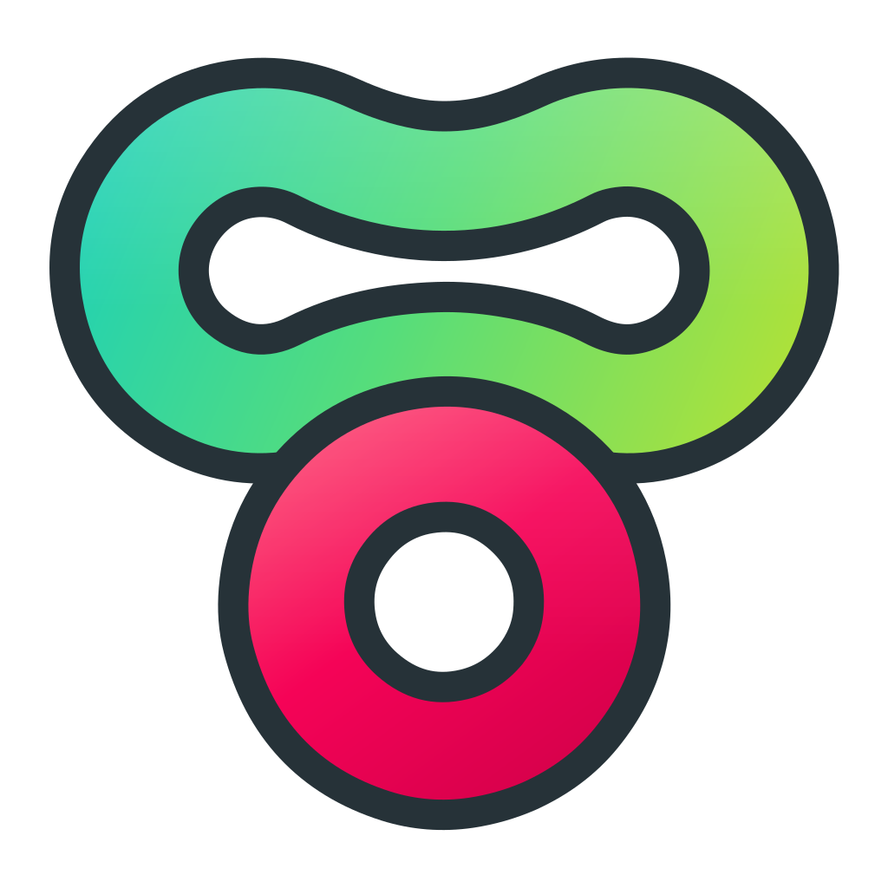

<h1>Tailor Author</h1>

**A configurable headless CMS, built for learning content.**

Traditional courses, adaptive learning paths, knowledge bases, content libraries - or a shape of your own. Author it in one place, reuse it across projects, and publish to storage you own.

[![License][badge-license]][link-license] &nbsp; [![Version][badge-version]][link-releases] &nbsp; [![CI][badge-ci]][link-ci] &nbsp; ![Node][badge-node] &nbsp; ![pnpm][badge-pnpm]

[**Documentation**][link-docs] &nbsp;·&nbsp; [**What's new in X**][link-x] &nbsp;·&nbsp; [**Element Kit**][link-kit] &nbsp;·&nbsp; [**Quickstart**](#quickstart) &nbsp;·&nbsp; [**Contributing**](#contributing)

<br>

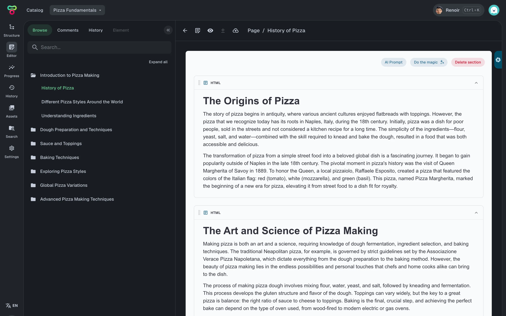

<sub>The editor - your outline on the left, the page you are writing on the right</sub>

<sub><b>Built-in extensions:</b> 27 content elements &nbsp;·&nbsp; 5 containers &nbsp;·&nbsp; 12 meta inputs<br>Every one is a swappable package, not core code &nbsp;·&nbsp; 10 example schemas included</sub>

</div>

> [!NOTE]
> **Tailor X** is here. Read the release brief at **[x.tailor-cms.com][link-x]**.
>
> Arrived from **ExtensionEngine/tailor**? You are in the right place - this is the project's current home, and the [original repository][link-legacy] is archived.

## Why Tailor

A course is not a list of pages with media. Pedagogy decides shape, and every approach wants a different one:

- **Direct instruction** runs linear - explain, demonstrate, check - and ends on a graded assessment.
- **Scenario-based learning** branches through decisions and debriefs each choice, so the outline is a web, not a line.
- **Microlearning** is small standalone units, revisited on a schedule, with no deep hierarchy at all.
- **Competency-based training** gates every level until the learner passes, so structure and assessment are the same thing.
- **Blended and flipped** designs split material into pre-work, live session and follow-up, each carrying different information.

Most content tools can express none of these, because they already decided the shape for you: here is a page, here are some fields, squeeze your material in.

<p align="center">
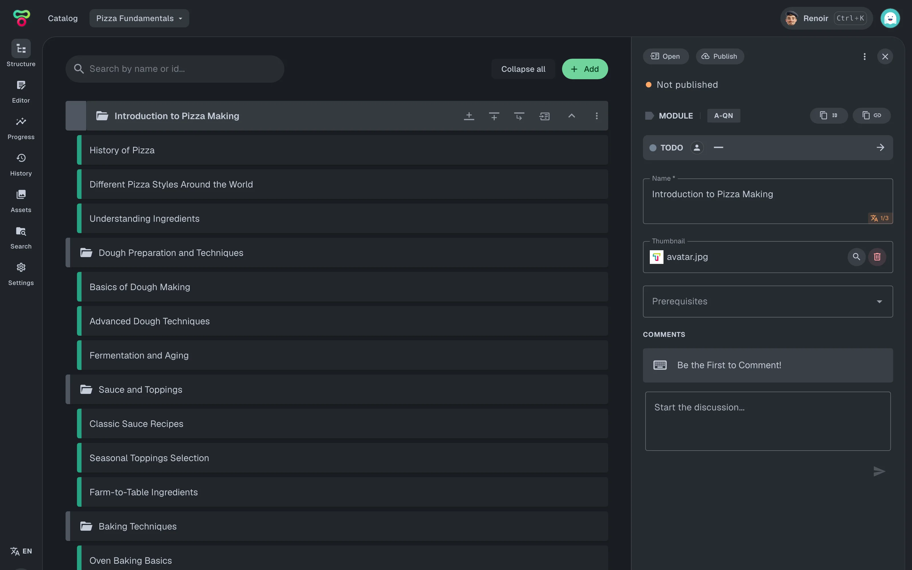
<br>
<sub>Levels you name yourself, nested as deep as the material needs, each carrying its own information</sub>
</p>

Tailor starts from **your** model instead. You describe the shape your material actually takes - the levels it needs, the checkpoints along the way, the information each one carries - and the whole application reshapes itself around it: the editor, the validation, the permissions, the published output. Bespoke learning experiences, tailored to the pedagogy, with no fork and no custom build.

- **Configurable, not hardcoded.** Content types are configuration. Changing your model is an edit, not a migration.
- **Deeply structured.** Content is a tree you nest as far as your material needs, not a flat pile of entries.
- **Learning-shaped, not learning-locked.** Assessments, question pools and progress are first-class - and the same schema system runs knowledge bases, Q&A libraries and article collections, all shipped as working examples.
- **Rich out of the box.** 27 content elements, 5 containers and 12 meta inputs ship built in - and every one is an extension package, written with the same API you'd use for your own.
- **AI that earns its keep.** A reviewer that scores your pages against rubrics, and an assistant that acts on whatever you have open.
- **Built for teams.** Comments, revisions, workflow states, per-role access and live editing updates come as standard.
- **Publish once, consume anywhere.** Publishing writes a clean, versioned manifest into storage you own - S3 or the filesystem. No proprietary delivery API sits between your content and whatever renders it: an LMS, your own app, a static site. Every built-in element also ships a Vue 3 display component, so rendering the result is not a from-scratch job.
- **MIT licensed.** Self-host it, fork it, ship it.

## Why not just use a regular headless CMS?

| | A typical headless CMS | Tailor |
| --- | --- | --- |
| **Your outline** | A flat list of entries. Any hierarchy is something you fake with reference fields and slugs. | A real tree, and you name the levels yourself - module, chapter, topic, unit, entry, whatever your material calls for. Each level sets what can sit inside it, and authors work directly in that tree. |
| **Where content lives** | A rich-text field and a few extra fields. Whether it reads as a lesson or a quiz is your frontend's problem. | Any level in your outline can hold content instead of more levels, and its **type** decides the shape that content takes - a reading page, a template of named sections, a timed exam, a pool of questions to draw from. You fill it with typed blocks: **27 in the box**, from tables and flashcards to eight kinds of question. |
| **The details you track** | The same fixed set of fields on every entry. | You decide what each level carries - say, a duration on a module, a difficulty on a page, a source note on one image. Different fields at every level, all set in the schema. |
| **Checking understanding** | Not something it does. You store questions as entries and grade them in another system. | Eight kinds of question, graded or ungraded, written right next to the material they test - and grouped into an exam or a pool to draw from. |
| **Using something twice** | Point at another entry by its ID. A copy is a copy. | Reuse one question, a page, or an entire module in another project. The copy stays in step with the original until you change it - then it's yours. |
| **Making it fit** | You can add new field types. | Add a new kind of block, a new way to lay content out, a new field, or a whole app-wide feature. Four places to extend, and each project installs only the ones it uses. |

Publishing a blog or a marketing site? Use one of those instead - they are better at it. Tailor earns its keep when the structure itself matters: real depth, checks along the way, information that differs per level, and material reused across projects.

## What you can do

### ✍️ Author without detours

- **One workspace.** Build the outline and write the content in the same view - add, reorder and edit anything inline, with no jumping between screens.
- **Discuss in place.** Comment on any activity or individual element, resolve threads, and keep the conversation next to the work instead of in a chat app.
- **Find any element.** Search every piece of content in a project, with highlighted snippets and in-place preview.
- **Every change on record.** Browse a page's past versions, restore one with a click, or roll an entire project back to any point in its history.
- **See what a republish will change.** Compare any page against the version already published, so nothing ships by surprise - and the project tells you at a glance when it has unpublished changes.
- **Templates with guardrails.** Build a level out of named sections you define in the schema - each with its own fields and its own content - so every page of that kind comes out consistent.
- **Author in any language.** Switch your working language and translate rich text inline; visual cues flag what's still untranslated.
- **Make it yours.** Light and dark themes, plus a color system to rebrand the whole app.

<p align="center">
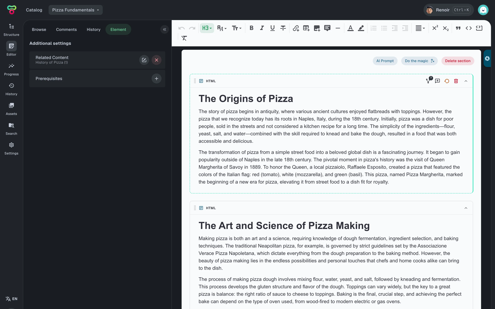 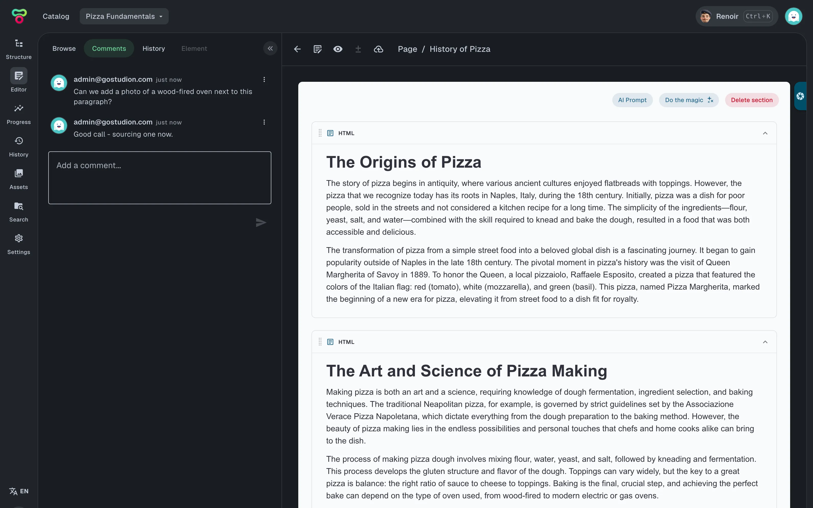
<br>
<sub><b>Edit in place</b> - every block, with its own settings &nbsp;·&nbsp; <b>Discuss in place</b> - threads next to the work</sub>
</p>

### ✨ AI that does the heavy lifting

- **Lens** is your pre-publish reviewer. It scores every page against quality rubrics - clarity, credibility, accessibility, publish-readiness - flags blockers, and turns each one into a concrete fix.
- **Renoir is an agent, not a chat box.** Give it a goal and it plans the work, then carries it out on the project you have open - reaching for any of 30 tools to restructure an outline, create and refine elements, find and import media, or generate a whole section. It reads your schema before it acts, so what it builds fits your model, and it stops to ask when a decision is yours to make.
- **Media discovery** surfaces the right images for exactly the section you're working on and pulls them into your library, ready to use.

<p align="center">
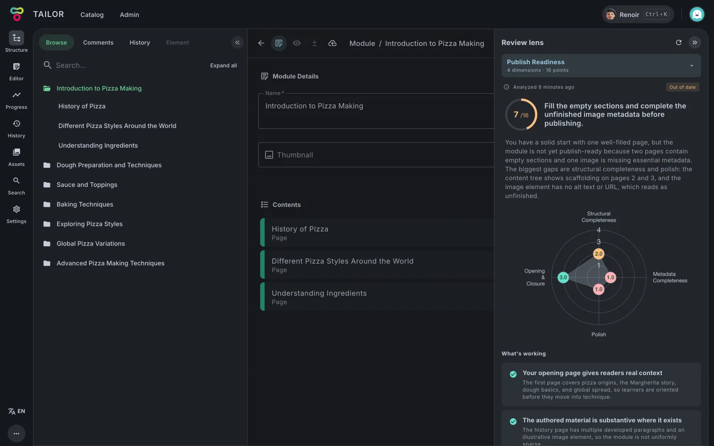 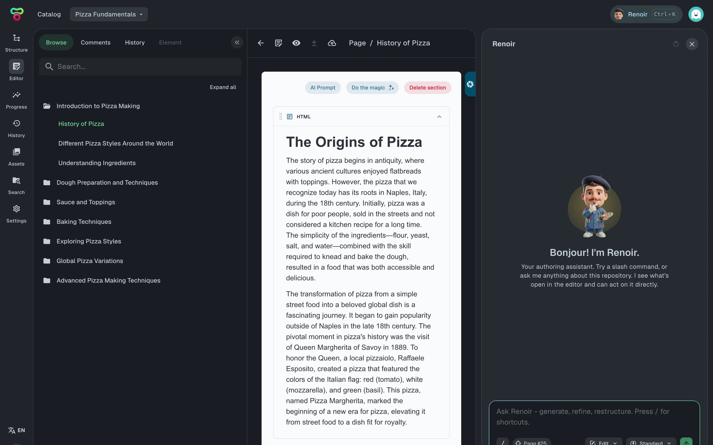
<br>
<sub><b>Lens</b> - scored against a rubric, turned into fixes &nbsp;·&nbsp; <b>Renoir</b> - an agent working on the project you have open</sub>
</p>

### ♻️ Build once, reuse everywhere

- **Link it, don't copy it.** Reuse a question, a page or an entire module from another project. Linked copies stay in sync with their source - and the moment you edit one, it's yours.
- **Collections.** Model short-form material as flat entities that relate to each other - articles to authors, terms to topics - instead of forcing it into a tree.
- **Asset library.** Upload, import and organize every file in one place, trace exactly where each one is used before you change it, and pull in what's missing straight from the web.

<p align="center">
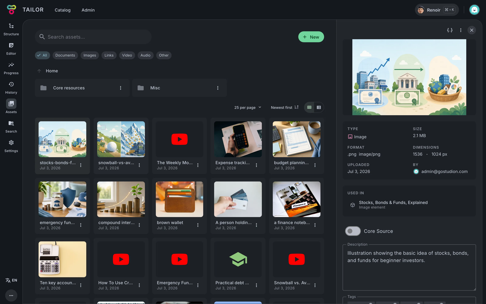 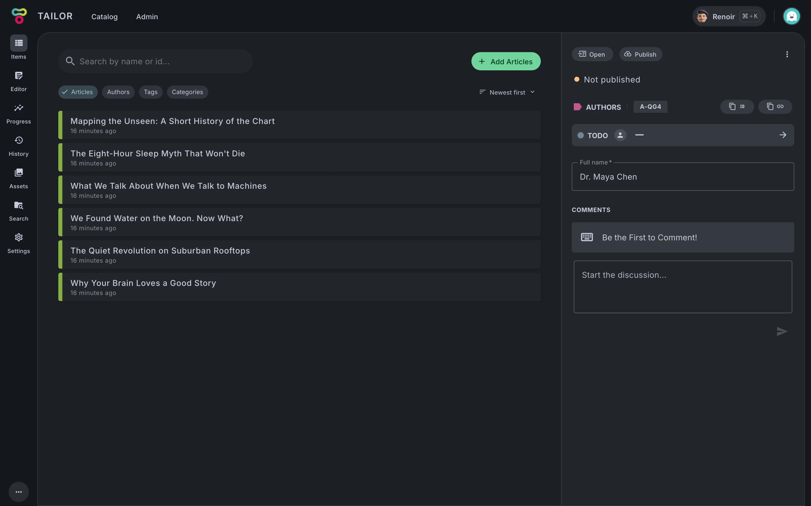
<br>
<sub><b>Asset library</b> - every file in one home &nbsp;·&nbsp; <b>Collections</b> - flat entities, related as you write</sub>
</p>

### 👥 Run it across an organisation

- **Groups, not just people.** Put users into groups, give a group access to a set of projects, and set someone's role per group as well as per project.
- **Single sign-on.** OIDC alongside local accounts and email invites.
- **A workflow you define.** Move each part of a project through your own states, with priority, assignee and due date, on a board or in a list.
- **Know what's live.** Every project flags when it has unpublished changes, and any page can be compared against its published version before you republish.
- **Move projects between environments.** Export a whole project - structure, content and media - and import it elsewhere. Clone one to start the next.

## How content is modelled

Four ideas, and a schema that decides how they fit together.

| Concept | What it is |
| --- | --- |
| **Repository** | One unit of content - a course, a knowledge base, a collection of articles. |
| **Activity** | A step in your outline. You name the levels and decide which can sit inside which, so the tree goes as deep as your material needs. |
| **Content Container** | The type given to a level that holds content rather than more levels. It decides how that content is laid out and what belongs there - a reading page, a template of named sections, an exam, a pool of questions. |
| **Content Element** | The thing an author actually places: a paragraph, an image, a video, a flashcard, a question. |

In practice, that looks like this:

```text
Pizza Fundamentals                    repository
└─ Introduction to Pizza Making       activity  (a module)
   ├─ History of Pizza                activity  (a page)
   │  ├─ Section                      content container
   │  │  ├─ Rich text                 content element
   │  │  ├─ Image                     content element
   │  │  └─ Multiple choice           content element
   │  └─ Assessment pool              content container
   └─ Baking Techniques               activity  (a module)
```

Anything in that tree can carry its own information - a duration on a module, a difficulty on a page, a source note on a single image - and your schema decides which. Reuse works at any level too: link one question, one page, or an entire module into another project.

Change the schema and the shape changes with it. These all ship as examples, and none of them is special-cased in the code:

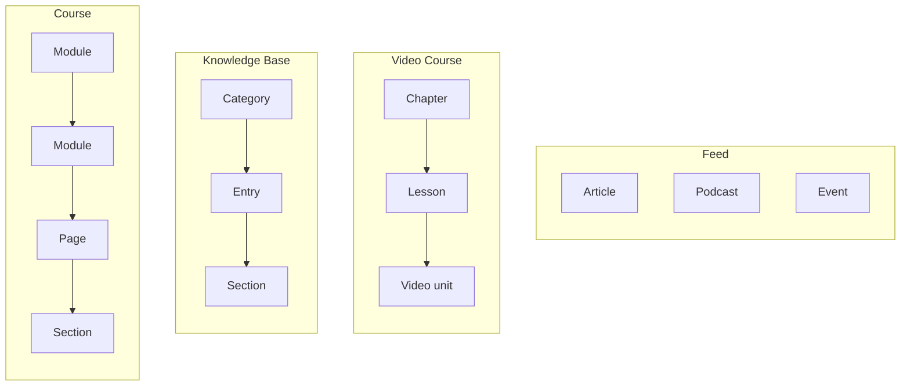
```mermaid
flowchart LR
  subgraph course["Course"]
    direction TB
    c1["Module"] --> c2["Module"] --> c3["Page"] --> c4["Section"]
  end
  subgraph kb["Knowledge Base"]
    direction TB
    k1["Category"] --> k2["Entry"] --> k3["Section"]
  end
  subgraph vc["Video Course"]
    direction TB
    v1["Chapter"] --> v2["Lesson"] --> v3["Video unit"]
  end
  subgraph feed["Feed"]
    direction TB
    f1["Article"]
    f2["Podcast"]
    f3["Event"]
  end
  course ~~~ kb ~~~ vc ~~~ feed
```

## What ships in the box

Nothing below is hardcoded into the core. Every item here is an **extension** - the same kind of package you'd write yourself, installed and versioned like any other. Each element comes in two halves: the authoring component your team writes with, and a Vue 3 display component that renders the published result for learners.

**27 content elements** - the blocks an author actually places:

| Group | Elements |
| --- | --- |
| **Text**        | Rich text (TipTap, Quill, Jodit), raw HTML                                                                                                                  |
| **Media**       | Image, video, audio, PDF, file, embed, Mux and Brightcove video                                                                                             |
| **Interactive** | Accordion, carousel, modal, table, flashcards, sequence, section break                                                                                      |
| **Questions**   | Single choice, multiple choice, true/false, matching, fill in the blank, numerical response, text response, drag & drop - each available graded or ungraded |

<p align="center">
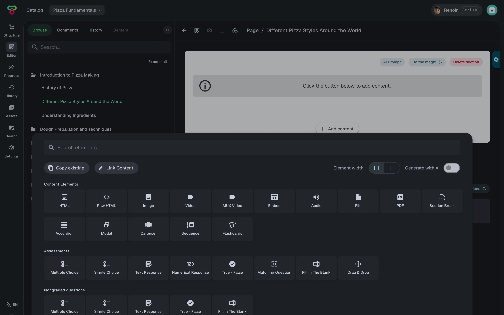
<br>
<sub>The picker an author sees - plus <b>Copy existing</b>, <b>Link Content</b> and <b>Generate with AI</b> on the same dialog</sub>
</p>

**5 content containers** decide how those blocks are laid out: a plain page; a template of named sections, each carrying its own fields and its own content; an exam; a pool of questions to draw from; and a collection item.

**12 meta inputs** attach configurable fields to a repository, an activity or a single element - text field, textarea, select, combobox, radio group, checkbox, switch, date/time, color, file, HTML and rating.

## Extensible at every level

Four extension points, each plugging in at a different level of the model. Everything user-facing is a package, so a project only carries the extensions it actually uses - install one, drop one, or list what is currently in, all without touching core.

| Extension | Plugs in at | What it adds | In the box | Manage |
| --- | --- | --- | --- | --- |
| 🧱 **Content Element**   | inside a container                                   | a new kind of block an author can place         | **27**     | `pnpm ce` |
| 📐 **Content Container** | on any level that holds content                      | a new way to lay that content out               | **5**      | `pnpm cc` |
| 🎛️ **Meta Input**        | on a repository, an activity **or** a single element | a new configurable field                        | **12**     | `pnpm mi` |
| 🔌 **Plugin**            | across the whole app                                 | a feature with its own UI, data hooks and state | i18n       | `pnpm pl` |

<p align="center">
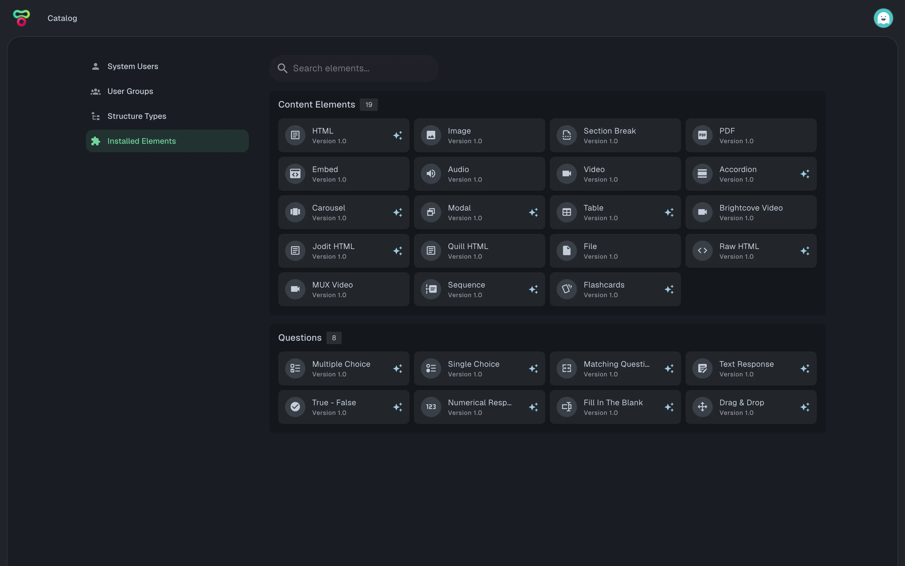
<br>
<sub>Every extension is a versioned package, listed and manageable from admin</sub>
</p>

Each command opens a small CLI for that extension type: **list** what a project has installed, **add** one, **remove** one, or **rebuild** the registry.

Writing your own? Start with the [extension guide][link-extensions]. For content elements there is also the [Content Element Kit][link-kit] - a separate project built alongside Tailor. It emulates the Tailor runtime and APIs, so you build both halves of an element in one place, with live previews: the authoring side your team writes with, and the display side that renders it for learners.

## Quickstart

You'll need **Node 26+**, **pnpm 11+** and **PostgreSQL 15+**. Docker is optional but gets you Postgres, Redis and S3 in one command.

```sh
git clone https://github.com/tailor-cms/author.git && cd author

docker compose -f docker-compose.dev.yaml up -d   # Postgres, Redis, MinIO
pnpm setup:dev                                    # install, configure, seed
pnpm dev                                          # http://localhost:8080
```

Sign in with `admin@gostudion.com` / `gostudion`.

<details>
<summary><b>Without Docker</b></summary>

Point `setup:dev` at your own PostgreSQL instance when it prompts you, then run `pnpm dev`. Redis and S3 are optional in development.

</details>

<details>
<summary><b>Running in production mode</b></summary>

```sh
cp .env.example .env   # fill in your configuration
pnpm build
pnpm db:migrate
pnpm start
```

Migrations apply automatically at boot unless you set `DATABASE_DISABLE_MIGRATIONS_ON_STARTUP`. Deployment to AWS is covered by the Pulumi program in [`infrastructure/`](./infrastructure) - see the [deployment guide][link-deploy].

</details>

## Under the hood

- **Frontend** - Nuxt 4, Vue 3, Vuetify 4, Material Design 3, Pinia.
- **Backend** - one handler per endpoint, validated end to end. The same schemas generate the OpenAPI spec and a fully typed API client.
- **Data** - PostgreSQL, optional Redis. Storage on S3 or the filesystem.
- **Auth** - local accounts, invites, and OIDC single sign-on.
- **Quality** - 448 Playwright tests across 62 spec files: functional, visual (Percy) and accessibility suites, on a sharded CI pipeline.

```
apps/frontend    the authoring UI
apps/backend     the API, publishing and AI services
apps/marketing   the x.tailor-cms.com release brief
config/          schemas - your content model, as configuration
extensions/      content element / container / meta input / plugin registries
packages/        shared libraries and the generated API client
tests/           Playwright: functional, visual, accessibility
docs/            source for docs.tailor-cms.com
infrastructure/  Pulumi program for AWS deployment
```

<details>
<summary><b>Common scripts</b></summary>

| Command                             | What it does                                     |
| ----------------------------------- | ------------------------------------------------ |
| `pnpm dev`                          | Run backend, frontend and the API client watcher |
| `pnpm dc`                           | The above, plus Docker Compose services          |
| `pnpm build`                        | Build every workspace package                    |
| `pnpm lint` / `pnpm typecheck`      | Lint and type-check the monorepo                 |
| `pnpm seed`                         | Load demo content                                |
| `pnpm db:migrate` / `pnpm db:reset` | Migrate or reset the database                    |
| `pnpm e2e:functional`               | Playwright functional suite                      |
| `pnpm e2e:visual` / `pnpm e2e:a11y` | Percy visual and accessibility suites            |
| `pnpm docs:dev`                     | Preview the documentation site locally           |

</details>

## More of the app

<p align="center">
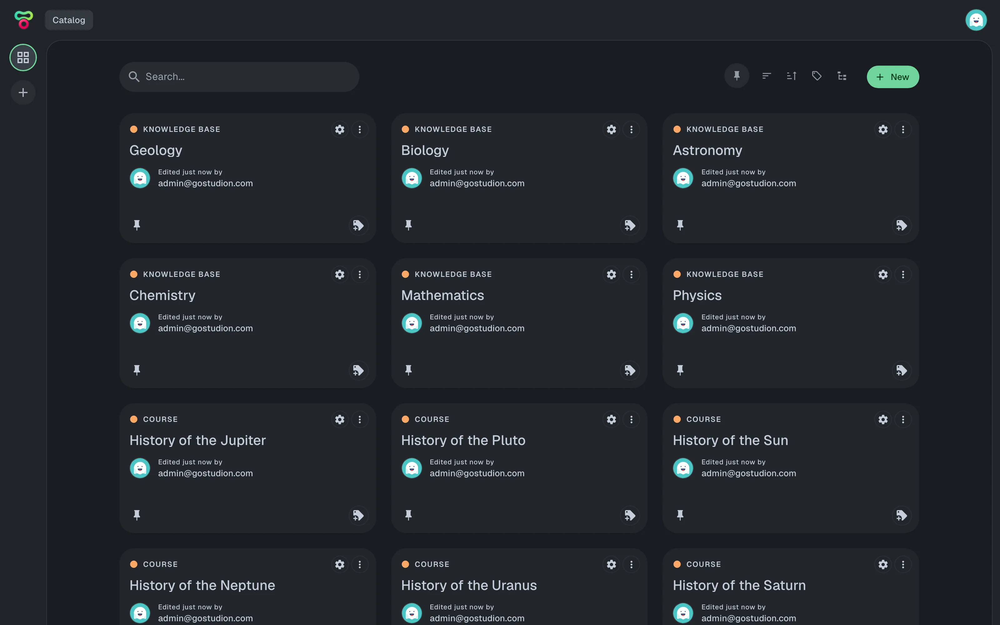 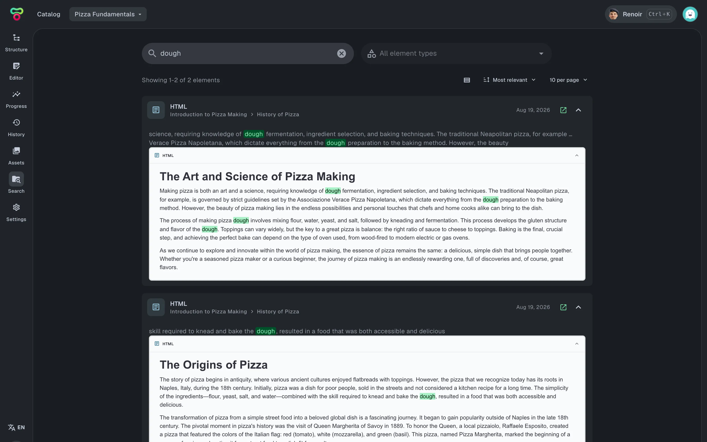
<br>
<sub><b>Catalog</b> - every project, labelled by type &nbsp;·&nbsp; <b>Search</b> - every element, previewed in place</sub>
<br><br>
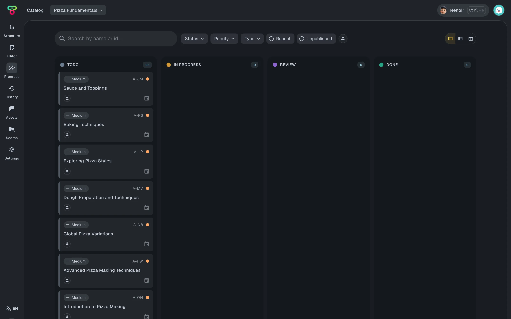 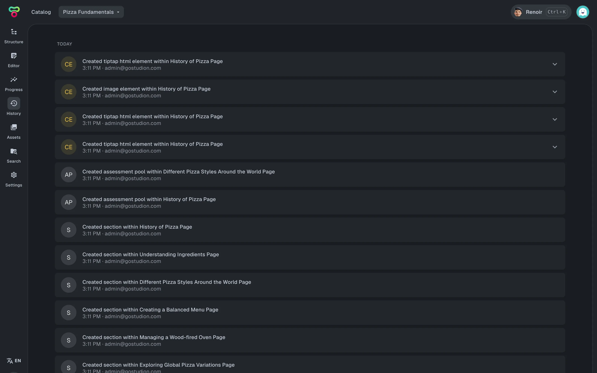
<br>
<sub><b>Workflow</b> - status, priority and assignee per activity &nbsp;·&nbsp; <b>History</b> - who changed what, and when</sub>
</p>

## Documentation

| Where | What you'll find |
| --- | --- |
| [**docs.tailor-cms.com**][link-docs]    | Concepts, configuration, extensions, publishing, deployment |
| [**x.tailor-cms.com**][link-x]          | What's new in Tailor X                                      |
| [**Content Element Kit**][link-kit]     | Separate toolkit for building elements - emulates the Tailor runtime, covers authoring and display |
| [**Publishing guide**][link-publishing] | The manifest format, and how to consume it in your app      |

## Contributing

Issues and pull requests are welcome. Open a [bug report][link-bug] or a [proposal][link-proposal] to get started, and check the [installation guide][link-setup] for a working development environment.

## License

[MIT](./LICENSE) © [Studion](https://gostudion.com)

## Acknowledgements

This project is tested with [BrowserStack][link-browserstack], who support open source with free cross-browser testing.

<div align="center">
<sub>Built on a decade of custom learning experiences. Made to measure since 2016.</sub>
</div>

[badge-license]: https://img.shields.io/github/license/tailor-cms/author?style=flat-square&color=1fd1b5&labelColor=263238
[badge-version]: https://img.shields.io/github/package-json/v/tailor-cms/author?style=flat-square&label=version&color=b8e232&labelColor=263238
[badge-ci]: https://img.shields.io/github/actions/workflow/status/tailor-cms/author/pr.yml?branch=main&style=flat-square&label=CI&labelColor=263238
[badge-node]: https://img.shields.io/badge/node-%E2%89%A5%2026-263238?style=flat-square
[badge-pnpm]: https://img.shields.io/badge/pnpm-11-263238?style=flat-square
[link-license]: ./LICENSE
[link-releases]: https://github.com/tailor-cms/author/releases
[link-ci]: https://github.com/tailor-cms/author/actions/workflows/pr.yml
[link-docs]: https://docs.tailor-cms.com
[link-x]: https://x.tailor-cms.com
[link-kit]: https://tailor-cms.github.io/xt/
[link-extensions]: https://docs.tailor-cms.com/dev/extensions/introduction
[link-publishing]: https://docs.tailor-cms.com/dev/publishing/introduction
[link-setup]: https://docs.tailor-cms.com/dev/general/setup
[link-deploy]: https://docs.tailor-cms.com/dev/general/deployment
[link-bug]: https://github.com/tailor-cms/author/issues/new?template=bug_report.yml
[link-proposal]: https://github.com/tailor-cms/author/issues/new?template=proposal.yml
[link-browserstack]: https://www.browserstack.com
[link-legacy]: https://github.com/ExtensionEngine/tailor
