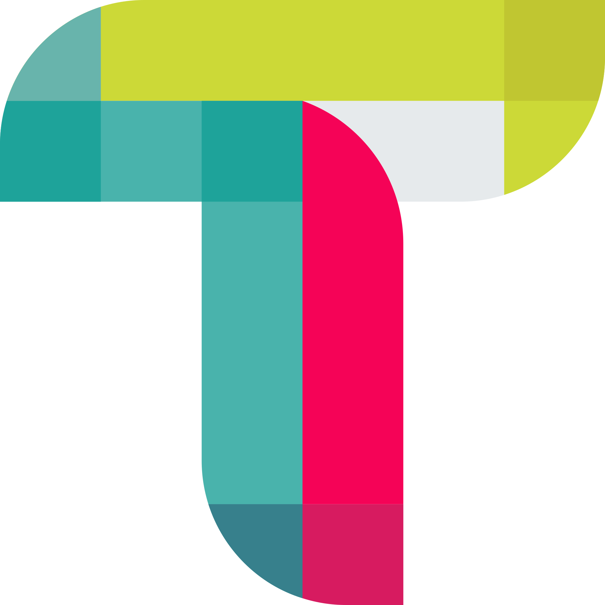

  

  <h1>Tailor Author</h1>

### Configurable headless CMS for complex content structures.

With unparalleled configurability and extensibility, Tailor CMS puts you in 
control. Enjoy an intuitive authoring experience that makes managing your 
content a breeze.

## Features

- ### ⚙️ Custom content structures
  Craft unique content structures using straightforward JSON definitions. 
  Whether you're building a custom Course or a Knowledge base, Tailor gives 
  you the tools to create your content exactly the way you need it.

- ### 📦 Experience limitless extensibility
  Extend and customize your digital experience with ease using our custom 
  elements, containers, and meta inputs. With Tailor, the possibilities for 
  your content are endless.

- ### 🚀 Effortlessly access published content
  Publish and consume content effortlessly, leveraging the power of configured 
  storage like AWS S3. Say goodbye to complex setups and hello to streamlined 
  workflows.

- ### 🌍 The power of collaboration at your fingertips
  With features like status tracking, content diffing, revisions, comments, 
  and live editing updates, your team can work together seamlessly on content 
  creation. Say goodbye to disjointed workflows and hello to real-time
  collaboration.

 

This project is tested with BrowserStack.
