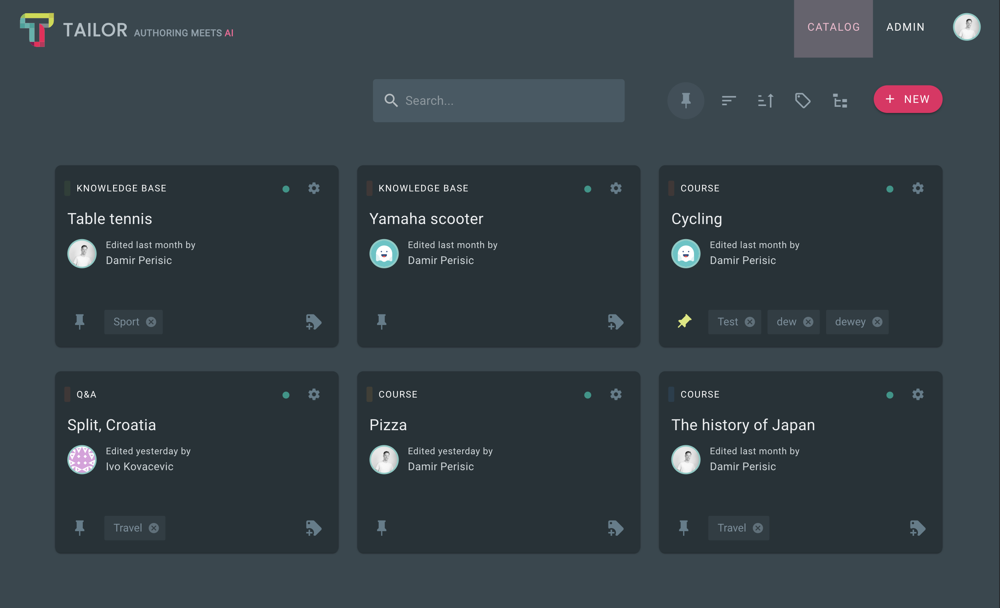

# Catalog of published Repositories

Referencing the introduction, content published with Tailor is stored in
the designated storage solution. A `repository` directory is established at
the root of this storage. Additionally, a `repository/index.json` file,
referred to as the catalog, is generated. This catalog offers a general
overview of all published repositories.

## Example

Consider the following list of the created Repositories within the
Tailor:



Here is the published Catalog file containing the list of published
Repositories:

```json
[
  {
    "id": 1,
    "uid": "5674d02c-86fc-4338-a725-fff69875ff20",
    "schema": "COURSE_SCHEMA",
    "name": "Pizza",
    "description": "A comprehensive course on crafting the perfect pizza.",
    "meta": { "color": "#FF9800" },
    "publishedAt": "2024-07-10T13:25:39.661Z",
    "detachedAt": null
  },
  {
    "id": 3,
    "uid": "705fd0d4-4078-45d6-8276-01a6f52c4d58",
    "schema": "COURSE_SCHEMA",
    "name": "The history of Japan",
    "description": "Overview of Japan's History",
    "meta": { "color": "#2196F3" },
    "publishedAt": "2024-07-10T13:24:51.980Z",
    "detachedAt": null
  },
  {
    "id": 4,
    "uid": "a7ad5092-428c-48f7-afb6-60b2f420d8dd",
    "schema": "KNOWLEDGE_BASE",
    "name": "Table tennis",
    "description": "Overview of the game",
    "meta": { "color": "#689F38" },
    "publishedAt": "2024-07-10T13:28:27.124Z",
    "detachedAt": null
  },
  {
    "id": 5,
    "uid": "360479a0-5564-4799-8ba8-680904df179c",
    "schema": "KNOWLEDGE_BASE",
    "name": "Yamaha scooter",
    "description": "Overview of Yamaha scooters",
    "meta": { "color": "#FF5722" },
    "publishedAt": "2024-07-10T13:27:38.066Z",
    "detachedAt": null
  },
  {
    "id": 6,
    "uid": "005e666d-54bf-446a-af66-fee83faf2484",
    "schema": "COURSE_SCHEMA",
    "name": "Cycling",
    "description": "Cycling overview",
    "meta": { "color": "#FF5722" },
    "publishedAt": "2024-07-10T13:26:56.989Z",
    "detachedAt": null
  },
  {
    "id": 7,
    "uid": "48938718-10b2-4d60-ad85-b6493493ab1f",
    "schema": "Q&A_SCHEMA",
    "name": "Split, Croatia",
    "description": "Exploring the History and Vibrant Culture of Split",
    "meta": { "color": "#FF5722" },
    "publishedAt": "2024-07-10T13:26:18.605Z",
    "detachedAt": null
  }
]
```

Let's examine an entry from the catalog to clarify fields that may require
additional context:

```json
{
  "id": 1,
  "uid": "5674d02c-86fc-4338-a725-fff69875ff20",
  // Schema which repository follows. For more details,
  // revisit the Concepts > Schema section.
  "schema": "COURSE_SCHEMA",
  "name": "Pizza",
  "description": "A comprehensive course on crafting the perfect pizza.",
  // Can contain additional data, depending on the Repository metadata
  // configuration
  "meta": { "color": "#FF9800" },
  // Last publish date
  "publishedAt": "2024-07-10T13:25:39.661Z",
  // Was the Repository deleted in the Authoring system?
  // When deleted in the Authoring system, published Repository entry
  // is kept in the Catalog, since target System might be still consuming
  // it. Target system can be notified via hook that the Repository has
  // been deleted.
  "detachedAt": null
}
```

:::tip Obtaining Repository details
ID of a specific published repository is essential for accessing its root 
manifest. For any published repository, the root manifest can be retrieved 
from the path `repository/[id]`.
:::
