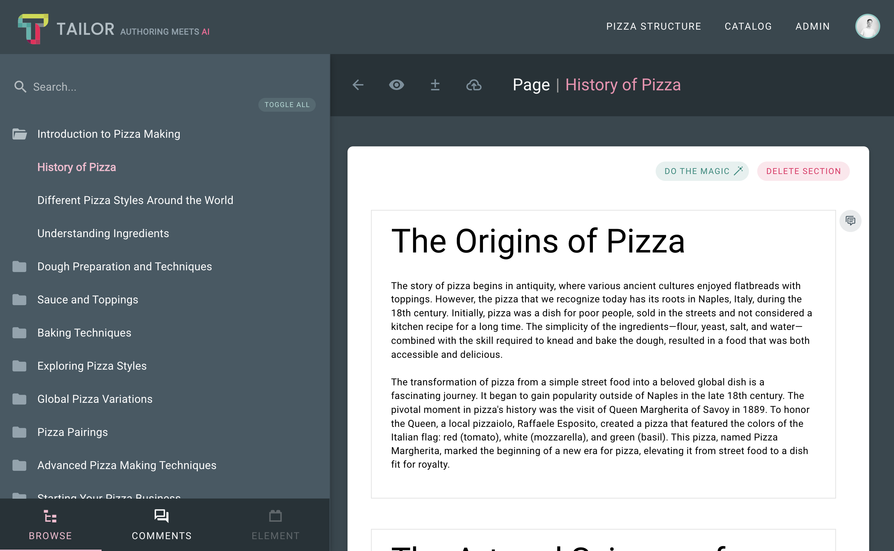

# Content Containers

Content Containers act as layout components, forming the foundation for 
crafting diverse and dynamic layouts with Content Elements. They cater 
to a wide range of needs and complexities. The simplest form of a 
Content Container is one that holds a plain array of Content Elements, 
which we refer to as the DEFAULT container.

Upon publishing, Content Elements are embedded into a Content Container and
stored as a single unit for optimized delivery. Typically, 
the entire container is presented as one cohesive unit (e.g. Section).

Published Content Containers are stored in the `repository/[repository_id]` 
directory. These files follow the naming convention `[id].container.json` 
where id represents the id of a Content Container. However, the naming can be 
customized based on the `publishedAs` property specified in the configuration 
(refer to the example below).

The internal structure of a Content Container is determined by the type of 
Container being published, along with the elements contained within it. 
These elements are separate components installed as extensions.

## Example

The example below illustrates a published default container. This example 
references the previously mentioned 'Pizza' course and the 'History of Pizza' 
Page within it, which has a DEFAULT container attached 
(type: SECTION, templateId: DEFAULT; see Content Container configuration
for more details):



Within the manifest file (refer to the previous section), we can locate the 
entry for this Page:

```json
    {
      "id": 11,
      "uid": "0d429766-8b74-4f7e-a0e9-c94c68cc6b90",
      "parentId": 1,
      "type": "COURSE_SCHEMA/PAGE",
      "position": 0,
      "publishedAt": "2024-07-10T13:25:06.719Z",
      "updatedAt": "2024-07-03T10:43:14.705Z",
      "createdAt": "2024-05-07T14:11:21.435Z",
      "relationships": {},
      "meta": { "name": "History of Pizza" },
      "contentContainers": [
        {
          "id": 36,
          "uid": "71c2438d-44da-4474-b610-6874a18dcb9c",
          "type": "SECTION",
          "publishedAs": "container",
          "elementCount": 5
        }
      ]
    }
```

Following this, we observe that it includes a single Content Container with 
an ID of 36. To access the content, we navigate to 
`repository/1/36.container.json`:

```json
{
  "id": 36,
  "uid": "71c2438d-44da-4474-b610-6874a18dcb9c",
  "type": "SECTION",
  "position": 1,
  "createdAt": "2024-05-08T10:41:49.382Z",
  "updatedAt": "2024-05-08T10:41:49.382Z",
  "status": [],
  "elements": [
    {
      "id": 2,
      "uid": "e5b0c315-033d-445a-8198-a72b2f10f451",
      "type": "HTML",
      "contentId": "afc62b76-d4ee-4707-ab26-ff95728c51e9",
      "contentSignature": "bd2deee9eb79e29ab9af39ae8860031674359c03",
      "position": 1,
      "data": {
        "content": "<h3 class='text-h3 mb-7'>The Origins of Pizza</h3><p class='text-body-2 mb-5'>The story of pizza begins in antiquity, where various ancient cultures enjoyed flatbreads with toppings. However, the pizza that we recognize today has its roots in Naples, Italy, during the 18th century. Initially, pizza was a dish for poor people, sold in the streets and not considered a kitchen recipe for a long time. The simplicity of the ingredients—flour, yeast, salt, and water—combined with the skill required to knead and bake the dough, resulted in a food that was both accessible and delicious.</p><p class='text-body-2 mb-5'>The transformation of pizza from a simple street food into a beloved global dish is a fascinating journey. It began to gain popularity outside of Naples in the late 18th century. The pivotal moment in pizza's history was the visit of Queen Margherita of Savoy in 1889. To honor the Queen, a local pizzaiolo, Raffaele Esposito, created a pizza that featured the colors of the Italian flag: red (tomato), white (mozzarella), and green (basil). This pizza, named Pizza Margherita, marked the beginning of a new era for pizza, elevating it from street food to a dish fit for royalty.</p>"
      },
      "meta": {},
      "refs": {},
      "createdAt": "2024-05-09T12:33:55.356Z",
      "updatedAt": "2024-05-09T12:33:55.356Z"
    },
    {
      "id": 1,
      "uid": "1b0562f6-fe69-4e11-9ac1-4d8ceb2b1336",
      "type": "HTML",
      "contentId": "a4768059-b661-425f-a90c-24d2e56a1326",
      "contentSignature": "21394d772ff63cbe46e39c777f354d53fc75beec",
      "position": 2,
      "data": {
        "content": "<h3 class=\"text-h3 mb-7\">The Art and Science of Pizza Making</h3><p class=\"text-body-2 mb-5\">Making pizza is both an art and a science, requiring knowledge of dough fermentation, ingredient selection, and baking techniques. The traditional Neapolitan pizza, for example, is governed by strict guidelines set by the Associazione Verace Pizza Napoletana, which dictate everything from the dough preparation to the baking method. However, the beauty of pizza making lies in the endless possibilities and personal touches that chefs and home cooks alike can bring to the dish.</p><p class=\"text-body-2 mb-5\">The process of making pizza dough involves mixing flour, water, yeast, and salt, followed by kneading and fermentation. This process develops the gluten structure and flavor of the dough. Toppings can vary widely, but the key to a great pizza is balance: the right ratio of sauce to cheese to toppings. Baking is the final, crucial step, and achieving the perfect bake can depend on the type of oven used, from wood-fired to modern electric or gas ovens.</p><p class=\"text-body-2 mb-5\">As we continue to explore and innovate within the world of pizza making, the essence of pizza remains the same: a delicious, simple dish that brings people together. Whether you're a seasoned pizza maker or a curious beginner, the journey of pizza making is an endlessly rewarding one, full of discoveries and, of course, great flavors.</p>"
      },
      "meta": {},
      "refs": {},
      "createdAt": "2024-05-09T12:33:55.347Z",
      "updatedAt": "2024-06-05T18:22:08.858Z"
    },
    {
      "id": 3,
      "uid": "8d71eec4-e868-45b9-a4e0-e2e709cfcc65",
      "type": "HTML",
      "contentId": "a47967f4-f6f3-4093-8fc3-459b2cf30e8a",
      "contentSignature": "496330c0a61006fe855b481e05c0826fa2e0ffcb",
      "position": 3,
      "data": {
        "content": "<h3 class=\"text-h3 mb-7\">Pizza Goes Globala</h3><p class=\"text-body-2 mb-5\">The migration of Italians to other parts of the world in the late 19th and early 20th centuries played a crucial role in the globalization of pizza. Italian immigrants brought their culinary traditions with them, including pizza, introducing it to the United States and other countries. Initially, pizza remained within Italian communities, but it began to cross cultural boundaries in the mid-20th century. The post-World War II era saw a boom in pizza's popularity in the United States, leading to the birth of pizza chains and the development of distinct styles, such as Chicago's deep dish and New York's thin crust.</p><p class=\"text-body-2 mb-5\">The latter half of the 20th century and the early 21st century have seen pizza's continuous evolution and its adaptation to different cultures and tastes worldwide. Today, pizza is a global phenomenon, with countless variations reflecting local flavors and preferences. From the classic Neapolitan to innovative creations that incorporate ingredients from various cuisines, pizza's versatility has allowed it to become one of the most beloved foods around the world.</p>"
      },
      "meta": {},
      "refs": {},
      "createdAt": "2024-05-09T12:33:55.354Z",
      "updatedAt": "2024-06-07T08:40:43.492Z"
    },
    {
      "id": 4,
      "uid": "38c998b0-be81-4344-8c99-2185bdd0a285",
      "type": "IMAGE",
      "contentId": "f8fd5fab-d04b-4423-8f01-8e024e032bd0",
      "contentSignature": "190d7a300882a0eb6b69ee244aded8ed448d6a9c",
      "position": 4,
      "data": {
        "assets": {
          "url": "storage://repository/assets/588968bd-66d6-4834-86ba-ff26ce6a8a8f__img-4tv0H39FNYVYaRsKEADgpNnt.png"
        }
      },
      "meta": {},
      "refs": {},
      "createdAt": "2024-05-09T12:33:55.359Z",
      "updatedAt": "2024-05-09T12:33:55.359Z"
    },
    {
      "id": 195,
      "uid": "e1892374-770b-447f-a8fd-e4d79f2c3fe9",
      "type": "HTML",
      "contentId": "85dddff5-3d6c-4f52-9740-1f3f1012d226",
      "contentSignature": "78c1b493ac522bbece5c6688494d72f3531a9930",
      "position": 5,
      "data": { "width": 12, "content": "" },
      "meta": {},
      "refs": {},
      "createdAt": "2024-07-03T10:43:14.665Z",
      "updatedAt": "2024-07-03T10:43:14.665Z"
    }
  ],
  "publishedAs": "container",
  "templateId": "DEFAULT"
}
```
