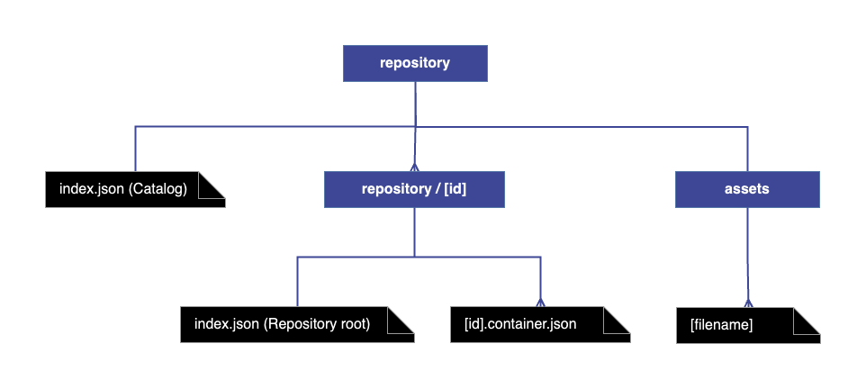

# Introduction

:::tip
For those new to Tailor, it's recommended to familiarize yourself with
foundational concepts such as Repository, Activity or Content Container by 
exploring the `Concepts` section.

\
For those more interested in retrieving published entities rather than 
the format of published content, consider exploring the 
[Garment library](https://github.com/underscope/garment). Note that a flat 
repository structure is required for its use (see below).
:::

## Storage root

When content is published using Tailor, it's stored in the configured storage 
solution of your choice. Currently, Tailor supports adapters for local 
storage and AWS S3. Publishing content makes is ready for application 
ingestion and delivery.

Here's how Tailor organizes content in the storage:

- `repository` directory is created in the storage root.
- `repository/index.json` file, known as the catalog, is created to provide
  an overview of all published repositories.
- `repository/${ID}` directory is created for each published content
  repository, named by its unique ID.
- `repository/assets` directory is created for static asset storage 
  (e.g. images). This is because assets might be reused across different 
  repositories.

## Published Repository structure

The published repository is structured around two main types of files:

1. **Repository Root File (`index.json`):** Located at `repository/${ID}/index.json`,
  this single file contains general information about the repository and 
  outlines the repository structure. It includes details on the activities 
  that define the structure of the repository.

2. **Content Container Files (`[id].container.json`):** There are multiple 
   content container files, named `[id].container.json`, where `id` corresponds
   to the published content containers. These files contain the specific
   content and metadata for each container.

For additional information, refer to the dedicated documentation pages.

\
When publishing repositories, there are two primary options for structuring
the published content within the `repository/${ID}` directory:

- **Flat Repository Structure**
- **Nested Repository Structure** (deprecated)

### Flat Structure

To enable the flat repository structure, the environment variable 
`FLAT_REPO_STRUCTURE=1` must be set. This structure, which is now the default,
consolidates all published activities within the `repository/${ID}` 
folder.



Consider simple Repository schema defined as:

```js
const SCHEMA = {
  id: 'PAGE_COLLECTION',
  name: 'Page collection',
  structure: [
    {
      type: 'PAGE',
      label: 'Page',
      color: '#08A9AD',
      contentContainers: ['SECTION'],
    },
  ],
  contentContainers: [
    {
      type: 'SECTION',
      templateId: 'DEFAULT',
      label: 'Section',
    },
  ],
};
```

When a repository is created and assigned an ID (for example, ID 1), 
and it includes activities such as Page 1, Page 2, and Page 3, each containing 
a single Section container (with IDs 4, 5, 6 respectively), the publication of 
the entire repository results in the following structure:

- `repository/index.json`: Contains general information about the repository,
  such as its ID, name, description, and the date it was last published.
- `repository/1/index.json`: Includes general information about the repository,
  details of all the Pages, and some additional data.
- `repository/1`: This folder contains all the published Section
  containers: `4.container.json`, `5.container.json`, `6.container.json`.

### Nested Structure

In contrast, the nested structure (which is now deprecated) organizes content
differently. Each structural activity, such as Page 1, Page 2, and Page 3
(assigned IDs 1, 2, 3 respectively), would have its content container stored
within a specific `<activity_id>` folder inside the `<content_repository_id>`
folder. This means the containers would be located at:
- `repository/1/1/4.container.json` for Page 1,
- `repository/1/2/5.container.json` for Page 2,
- `repository/1/3/6.container.json` for Page 3.
