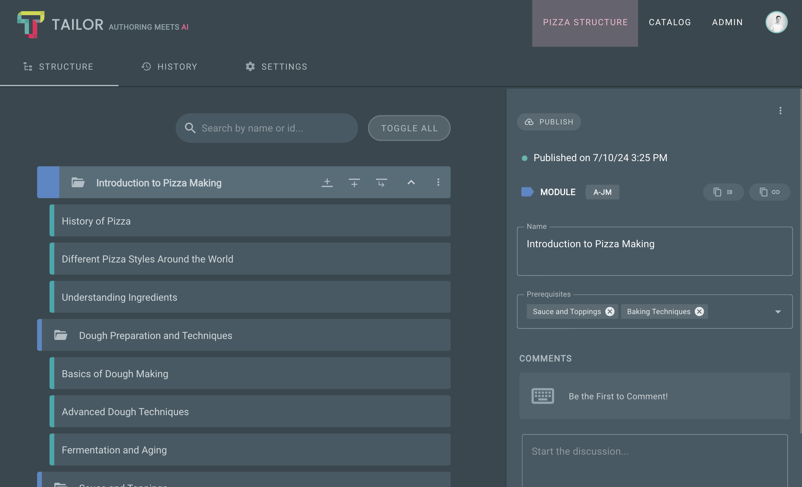

# Repository manifest

Repository manifest file, located at `repository/[id]/index.json`, contains 
general information about the Repository and Activities which define the 
Repository structure (visible in the 'structure' section of the app).

## Example

The example below shows a **Repository Manifest File**. Consider the following
Repository:



As mentioned earlier, manifest includes all Activities which make up
Repository structure. Each node with an attached Content Container publishes
basic information about the Container. This facilitates the resolution of the 
Content Container file which contains Content Elements. 

:::info Note
Structure list below contains first module and children for brevity.
:::

```json
{
  "id": 1,
  "uid": "5674d02c-86fc-4338-a725-fff69875ff20",
  "schema": "COURSE_SCHEMA",
  "name": "Pizza",
  "description": "Pizza course",
  "meta": { "color": "#FF9800" },
  "structure": [
    {
      "id": 1,
      "uid": "7110e39a-07b9-4fb8-b119-ab4faad7c9bf",
      "parentId": null,
      "type": "COURSE_SCHEMA/MODULE",
      "position": 0,
      "publishedAt": "2024-07-10T13:25:05.825Z",
      "updatedAt": "2024-07-08T14:13:26.039Z",
      "createdAt": "2024-05-07T14:11:19.542Z",
      "relationships": { "prerequisites": [4] },
      "meta": { "name": "Introduction to Pizza Making" },
      "contentContainers": []
    },
    {
      "id": 11,
      "uid": "0d429766-8b74-4f7e-a0e9-c94c68cc6b90",
      "parentId": 1,
      "type": "COURSE_SCHEMA/PAGE",
      "position": 0,
      "publishedAt": "2024-07-10T13:25:06.719Z",
      "updatedAt": "2024-07-03T10:43:14.705Z",
      "createdAt": "2024-05-07T14:11:21.435Z",
      "relationships": {},
      "meta": { "name": "History of Pizza" },
      "contentContainers": [
        {
          "id": 36,
          "uid": "71c2438d-44da-4474-b610-6874a18dcb9c",
          "type": "SECTION",
          "publishedAs": "container",
          "elementCount": 5
        }
      ]
    },
    {
      "id": 15,
      "uid": "4a1d32a8-c79a-4dda-bbcc-fcd381937f2d",
      "parentId": 1,
      "type": "COURSE_SCHEMA/PAGE",
      "position": 1,
      "publishedAt": "2024-07-10T13:25:18.959Z",
      "updatedAt": "2024-06-12T12:39:13.931Z",
      "createdAt": "2024-05-07T14:11:21.533Z",
      "relationships": {},
      "meta": { "name": "Different Pizza Styles Around the World" },
      "contentContainers": [
        {
          "id": 37,
          "uid": "cd2982ba-dd25-4c19-8fce-097c5730677a",
          "type": "SECTION",
          "publishedAs": "container",
          "elementCount": 4
        }
      ]
    },
    {
      "id": 12,
      "uid": "786447d7-c330-4122-844a-d55ce19d36f1",
      "parentId": 1,
      "type": "COURSE_SCHEMA/PAGE",
      "position": 2,
      "publishedAt": "2024-07-10T13:25:27.095Z",
      "updatedAt": "2024-06-12T12:39:23.109Z",
      "createdAt": "2024-05-07T14:11:21.531Z",
      "relationships": {},
      "meta": { "name": "Understanding Ingredients" },
      "contentContainers": [
        {
          "id": 38,
          "uid": "d1adfa11-c4aa-41fb-bd39-6a517a0f9f83",
          "type": "SECTION",
          "publishedAs": "container",
          "elementCount": 7
        }
      ]
    },
  ],
  "version": "59ad7dcf4b1a1c405aa0ee4f25adac83e4f6b8cb",
  "publishedAt": "2024-07-10T13:25:39.661Z"
}
```
